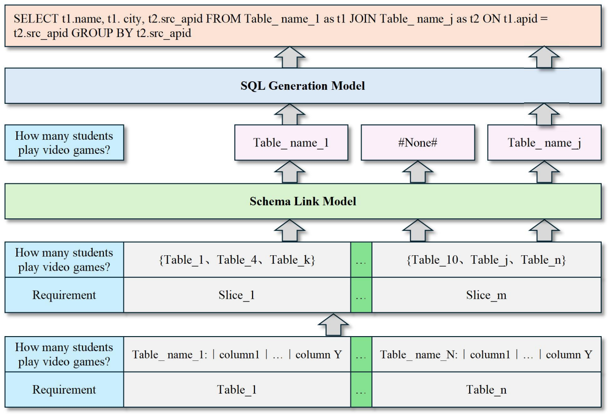

# LR-SQL

## Overview
This repository hosts the code for the LR-SQL paper, which is primarily used to accomplish Text2SQL tasks under resource-constrained conditions. We have simulated a large-scale database using the open-source dataset Spider and validated the effectiveness of our proposed method on this database. All models and experiments will be open-source, and all experimental results have been saved in Jupyter Notebook files.

### Paper
- https://arxiv.org/abs/2410.11457
  
  
### Requirements
- Project environment requirements, where requirement1.txt is suitable for GLM4 and Qwen2 models, and requirement2.txt is suitable for the Deepspeak model.
- During our experiments, we found that different versions of PEFT (Parameter-Efficient Fine-Tuning) libraries and Transformer libraries can lead to inconsistent memory usage during model fine-tuning. We used the GLM4 model from June 2024, but in August, GLM4 updated some of its files to be compatible with the latest version of the Transformer library. We recommend that when running our project, please strictly follow the environment requirements we provide and replace the existing GLM4 model files with the corresponding files from the GLM4_elder_file. Our CUDA version is cuda11.8, and the GPU model is 1 * A800 80G.

### schema_link
- Project files for the table prediction model, including the code and results of our proposed method as well as all comparative experiments.

### SQL_generation
- Project files for the SQL generation model, including the code and results of our proposed method, all comparative experiments, evaluation, and code for generating the SQL generation model dataset.
- Benchmark using the standard Spider dataset can be easily plug-and-play once the gold and predict files are available.
  
### Notes
- ~~The dataset for schema_link will be released after the preprint is published.~~
- ~~The code and the dataset for SQL generation model will be released after the preprint is published.~~
- If you need to verify our data generation process, please contact 2641873533@qq.com.

### Sponsorship and Support
- China Telecom Jiangsu Branch

